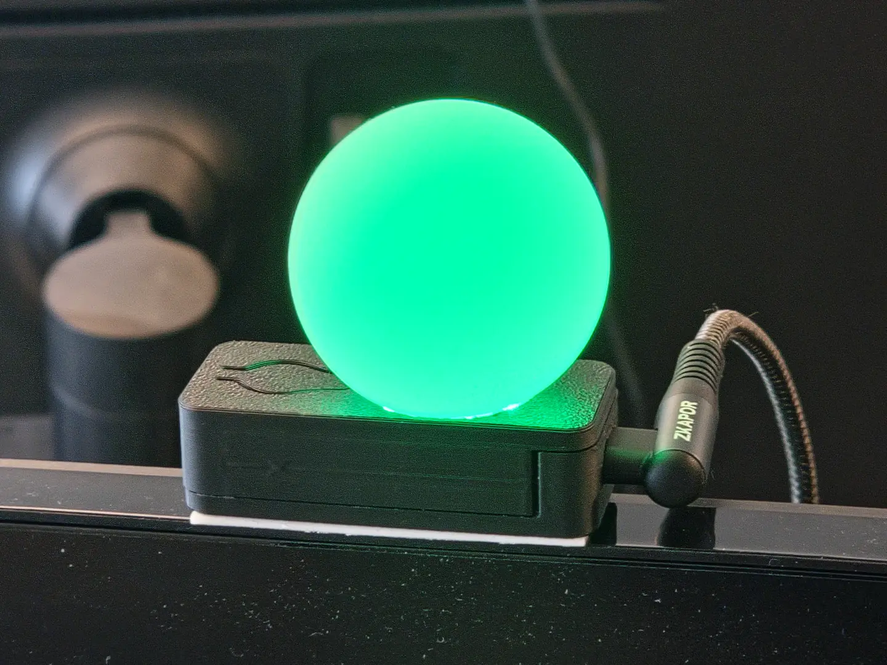

# Busylight

An indicator that shows coworkers if you are busy.

Intended to be mounted to your monitor and updated whenever your current state changes.

### Color Meanings
- 🟢 **Green** - Can be talked to casually.
- 🟡 **Yellow** - Concentrated, only ready to talk about the current project.
- 🔴 **Red** - In the Zone, do not talk to unless absolutely necessary.

### Controls

- Button:
    - Short press: Switch between colors
    - Long press: Turn on/off
- USB:
    - USB-HID device that can be used to set the color and switch it on/off
    - Turns off when the USB data connection stops (e.g. the PC is shut down).
        - Intended for monitors that power the device constantly, even if the PC is off

## Parts

- Table Tennis Ball as light diffusor
    - For best experience, choose seamless balls
- [Custom PCB](https://oshwlab.com/finomnis/busylight)
    - Orderable on JLCPCB for ~60 Euros / 10 PCBs
- 3D Printed Case
    - coming soon
- LEDs: BTF-LIGHTING 144LEDs/m WS2812B
    - German Amazon: https://amzn.eu/d/06CgZDho
    - 3 LEDs needed per device

## Firmware

In this repository.

## Instructions

Soon.
